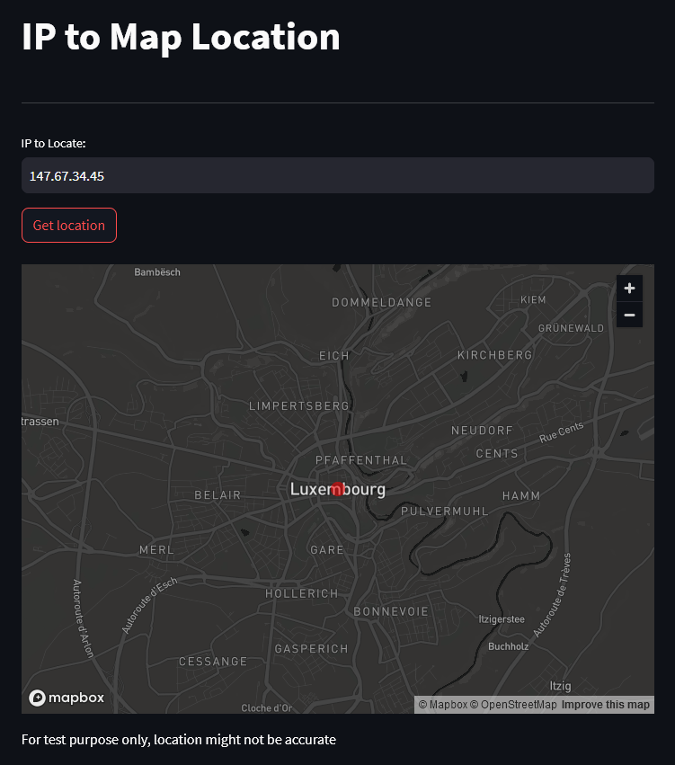

# IP to Map Location
## A simple streamlit app demonstrating ip2geotools and st.map

https://github.com/tomas-net/ip2geotools

https://docs.streamlit.io/library/api-reference/charts/st.map

https://www.ipify.org/

<hr>

Open a command prompt and `cd` to a new directory of your choosing:

Create a virtual environment with:
```
python -m venv "venv"
venv\Scripts\activate
```

To install do:
```
git clone https://github.com/vluz/IP2Location.git
cd IP2Location
pip install -r requirements.txt
```

To run do:
```
stramlit run ip2loc.py
```
The gui will open on a new page of your default browser.


To exit the virtual environment do:
```
venv\Scripts\deactivate
```

<hr>

Screenshot of example with the IP of `europa.eu`:



<hr>

Do not use in production, untested.
<br>
